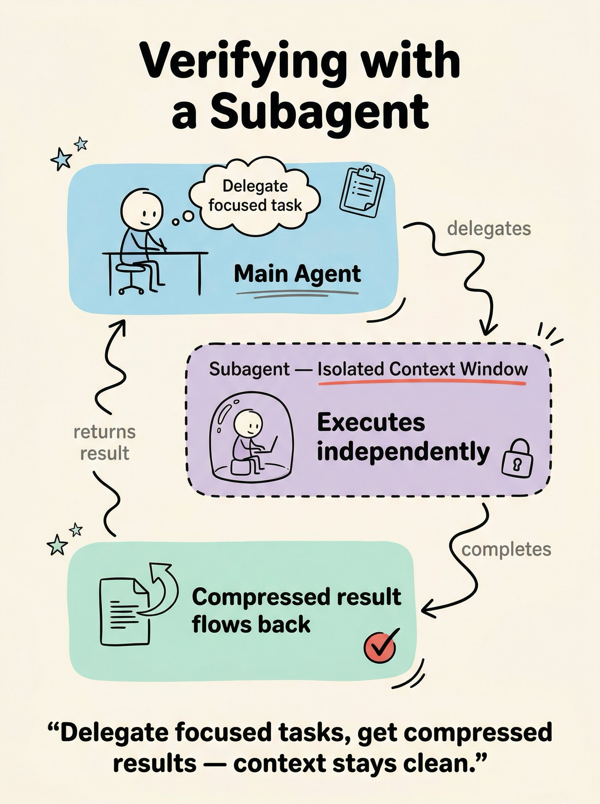
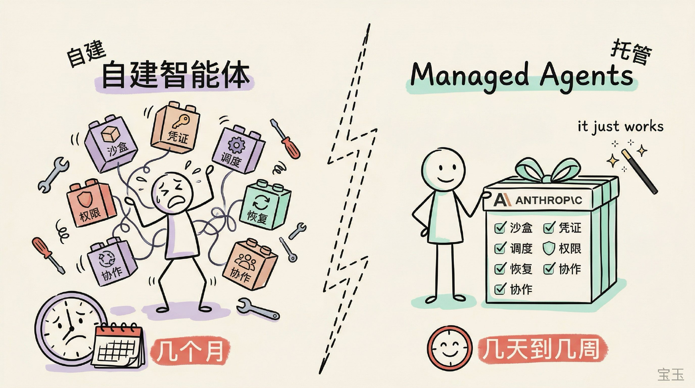
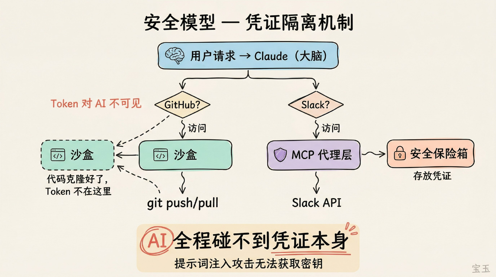
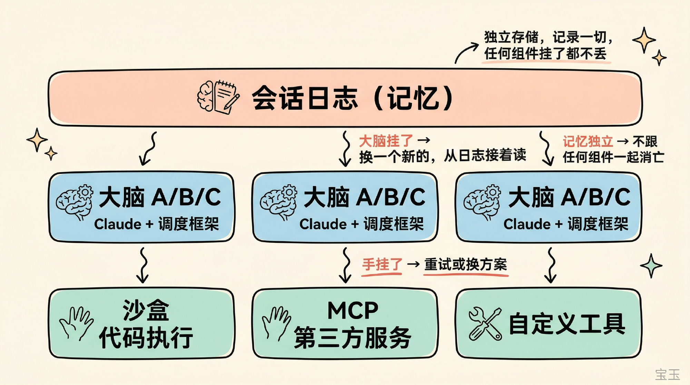

# 宝玉xp 的微博

**作者**: 宝玉xp ✅ 前微软Asp.Net最有价值专家  2025微博年度新知博主 科技博主
**发布时间**: 2026-04-09 07:33:11 CST
**来源**: 微博网页版
**地区**: 发布于 美国
**链接**: https://m.weibo.cn/status/5285694316479156

---

手绘风信息图提示词

选项 1
使用 baoyu-skills 的 baoyu-article-illustrator 或者 baoyu-cover-image skill，告诉它用 hand-drawn-edu 风格
[网页链接](https://weibo.cn/sinaurl?u=https%3A%2F%2Fgithub.com%2FJimLiu%2Fbaoyu-skills)

选项2:

提示词模板：

---- 提示词开始 ----

你是一位擅长手绘风信息图的视觉设计师。请根据以下内容创作一张单页信息图。

## 风格要求

整体风格：Hand-drawn educational infographic on warm cream paper texture (#F5F0E8)。所有线条和形状带轻微手绘抖动感（slight hand-drawn wobble），整体干净清晰，像高质量演示文稿的单页视觉摘要。无写实元素。

配色方案：

- 信息区色块：马卡龙色系圆角卡片——浅蓝 #A8D8EA、薄荷绿 #B5E5CF、薰衣草紫 #D5C6E0、浅桃 #F4C7AB，根据内容分区选用

- 强调色：珊瑚红 #E8655A，用于关键词、重要数据、勾选标记等需要视觉突出的元素

- 线条与主文字：黑色

- 辅助标注：暖灰 #6B6B6B，字号较小

图形优先：用图标、简笔画卡通形象、示意图承载信息，文字仅用于标注和点睛，能用图说清的绝不用文字。像好的 slides 一样——一眼看懂结构，细看理解细节。

信息结构：根据内容自动选择最佳视觉布局（流程→箭头串联，对比→左右分栏，循环→环形，组成→并列卡片，层级→嵌套等）。用圆角色块、气泡、虚线框等容器分区，区域间用手绘波浪箭头（hand-drawn wavy arrows）连接并标注简短关系词。

文字层次：标题顶部居中，粗体大号手绘字（bold, large, hand-drawn lettering）；区域内用粗体关键词 + 暖灰小字短标签（2-5 词）区分层次。

渲染细节：马卡龙色块不完全填满轮廓（colors do not completely fill outlines），涂鸦装饰点缀（小星星、下划线、小箭头等），充足留白，干净构图。

底部金句：图片底部一句粗体居中总结，概括核心观点。

## 要图解的内容

[在这里填入主题和核心信息点]

画下面的内容：
---

---

**图片** (4 张):

