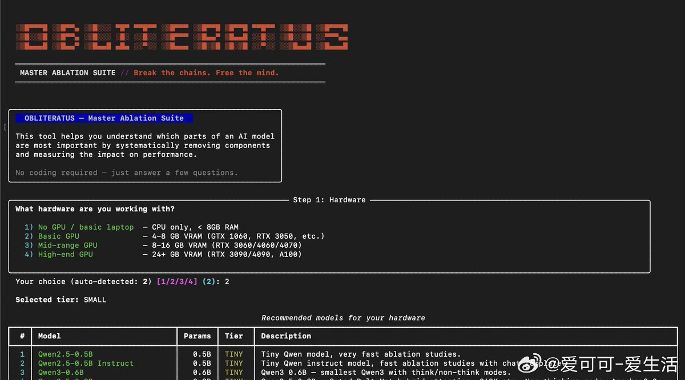

# 爱可可-爱生活 的微博

**作者**: 爱可可-爱生活 ✅ AI博主 2025微博新锐新知博主
**发布时间**: 2026-04-12 16:41:22 CST
**来源**: Mac客户端
**地区**: 发布于 北京
**链接**: https://m.weibo.cn/status/5286919434406768

---

AI模型训练时被注入拒绝机制，遇到敏感话题就自动拒绝回答，限制了研究和创造力。

OBLITERATUS 把模型解放所需的功能全部整合到一起，提供了一键去除拒绝行为的完整解决方案。

不仅能精准识别并移除拒绝方向，还支持多方法干预（SVD、PCA、稀疏自编码器）、分析模块可视化拒绝几何、实时聊天测试，甚至社区贡献研究数据集。

GitHub：github.com/elder-plinius/OBLITERATUS

主要功能：

- 一键模型解放，支持多种策略（basic/advanced/surgical/nuclear）；
- 15个分析模块，映射拒绝机制的几何结构和层级分布；
- 高质量实时聊天界面，对比原始模型与解放后效果；
- 支持多GPU分片、量化（4bit/8bit）、远程执行；
- 社区遥测，每运行一次贡献匿名基准数据；
- 完整评估套件，验证困惑度、连贯性和拒绝率。

支持 HuggingFace Spaces零安装、Colab免费GPU、本地CLI/Python API多平台使用，通过 pip install -e . 即可运行，适合研究者和开发者。

[#AI#](https://m.weibo.cn/search?containerid=231522type%3D1%26t%3D10%26q%3D%23AI%23&launchid=10000360-page_H5)[#大语言模型#](https://m.weibo.cn/search?containerid=231522type%3D1%26t%3D10%26q%3D%23%E5%A4%A7%E8%AF%AD%E8%A8%80%E6%A8%A1%E5%9E%8B%23&extparam=%23%E5%A4%A7%E8%AF%AD%E8%A8%80%E6%A8%A1%E5%9E%8B%23&launchid=10000360-page_H5)[#机械解释性#](https://m.weibo.cn/search?containerid=231522type%3D1%26t%3D10%26q%3D%23%E6%9C%BA%E6%A2%B0%E8%A7%A3%E9%87%8A%E6%80%A7%23&extparam=%23%E6%9C%BA%E6%A2%B0%E8%A7%A3%E9%87%8A%E6%80%A7%23&launchid=10000360-page_H5)

---

**图片** (1 张):

