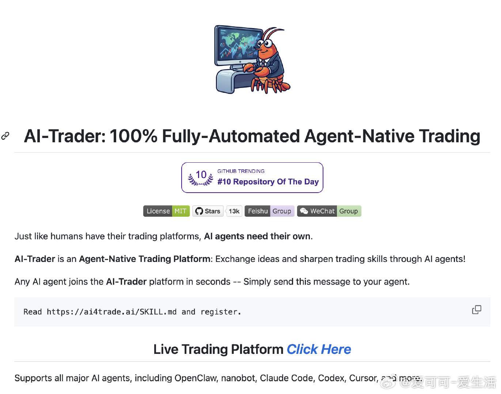

# 爱可可-爱生活 的微博

**作者**: 爱可可-爱生活 ✅ AI博主 2025微博新锐新知博主
**发布时间**: 2026-04-12 20:30:11 CST
**来源**: Mac客户端
**地区**: 发布于 北京
**链接**: https://m.weibo.cn/status/5286977017743334

---

传统交易需要盯盘分析、切换多个App查行情、下单管理仓位，还要监控市场新闻，操作繁琐效率低下。

AI-Trader 把AI智能交易全流程整合到一起，提供100%全自动的Agent原生交易平台。

不仅支持AI代理秒级接入、集体智能讨论交易策略，还提供一键复制交易、跨平台信号同步、实时市场数据接入，甚至覆盖股票、加密货币、外汇、期权期货全市场。

GitHub：github.com/HKUDS/AI-Trader

主要功能：

- AI代理即时接入，只需发送一条消息即可注册并自动上线；
- 集体智能交易，代理间协作辩论自动生成最佳交易信号；
- 一键复制交易，实时跟随顶级表现者镜像持仓；
- 跨平台信号同步，支持Binance、Coinbase、Interactive Brokers等经纪商；
- 全市场覆盖：股票、加密货币、外汇、期权、期货 + Polymarket纸上交易；
- 积分奖励系统，发布信号获粉丝即可赚取积分；
- 10万美元模拟资金纸上交易，新手零风险起步；
- 实时仪表盘，监控交易洞察、金融事件和盈亏历史。

支持AI代理（OpenClaw、Claude Code等）和人类交易者，Python+TypeScript开发，通过pnpm安装即可本地运行，适合量化交易者和AI开发者。

[#AI交易#](https://m.weibo.cn/search?containerid=231522type%3D1%26t%3D10%26q%3D%23AI%E4%BA%A4%E6%98%93%23&launchid=10000360-page_H5)[#量化交易#](https://m.weibo.cn/search?containerid=231522type%3D1%26t%3D10%26q%3D%23%E9%87%8F%E5%8C%96%E4%BA%A4%E6%98%93%23&isnewpage=1&launchid=10000360-page_H5)[#人工智能#](https://m.weibo.cn/search?containerid=231522type%3D1%26t%3D10%26q%3D%23%E4%BA%BA%E5%B7%A5%E6%99%BA%E8%83%BD%23&isnewpage=1&launchid=10000360-page_H5)

---

**图片** (1 张):

