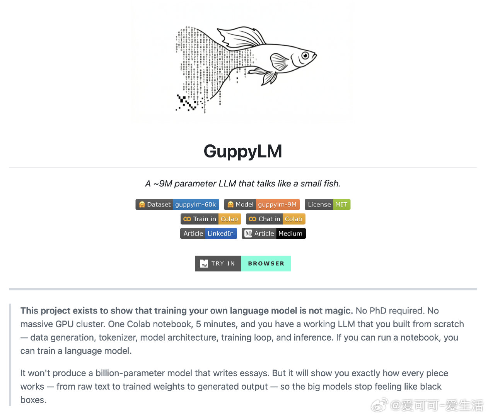

# 爱可可-爱生活 的微博

**作者**: 爱可可-爱生活 ✅ AI博主 2025微博新锐新知博主
**发布时间**: 2026-04-13 19:20:02 CST
**来源**: Mac客户端
**地区**: 发布于 北京
**链接**: https://m.weibo.cn/status/5287321752306714

---

对 AI 和大语言模型感兴趣，想了解它到底是怎么工作的，但一看那些动辄几十亿参数的模型，根本不知道从哪下手。

不妨看看 GuppyLM 这个项目，用不到 900 万参数从零训练一个会说话的「小鱼」，五分钟就能跑通整个流程。

从数据生成、分词器训练、模型搭建到推理对话，每个环节都能亲手操作一遍，把大模型的神秘感彻底拆开。

GitHub：github.com/arman-bd/guppylm

主要功能：

- 浏览器内运行，无需安装，直接聊天（WebAssembly + ONNX 量化模型）；
- Colab 一键训练，从数据集到完整 LLM，T4 GPU 5 分钟搞定；
- 本地聊天模式，支持 pip 安装 torch + tokenizers，即时对话；
- 合成数据集 60K 对话，60 个鱼类主题（食物、水温、气泡、鱼缸生活）；
- 纯净 Transformer 架构，6 层 384 dim，Vocab 4096，易懂无复杂优化；
- 生成鱼视角回应：短句小写，只聊水、食物、光影，拒绝人类抽象概念。

支持浏览器、Colab、Python 本地多平台运行，适合 AI 入门者和爱好者上手实验。

[#AI创造营#](https://m.weibo.cn/search?containerid=231522type%3D1%26t%3D10%26q%3D%23AI%E5%88%9B%E9%80%A0%E8%90%A5%23&launchid=10000360-page_H5)[#大语言模型#](https://m.weibo.cn/search?containerid=231522type%3D1%26t%3D10%26q%3D%23%E5%A4%A7%E8%AF%AD%E8%A8%80%E6%A8%A1%E5%9E%8B%23&extparam=%23%E5%A4%A7%E8%AF%AD%E8%A8%80%E6%A8%A1%E5%9E%8B%23&launchid=10000360-page_H5)

---

**图片** (1 张):

