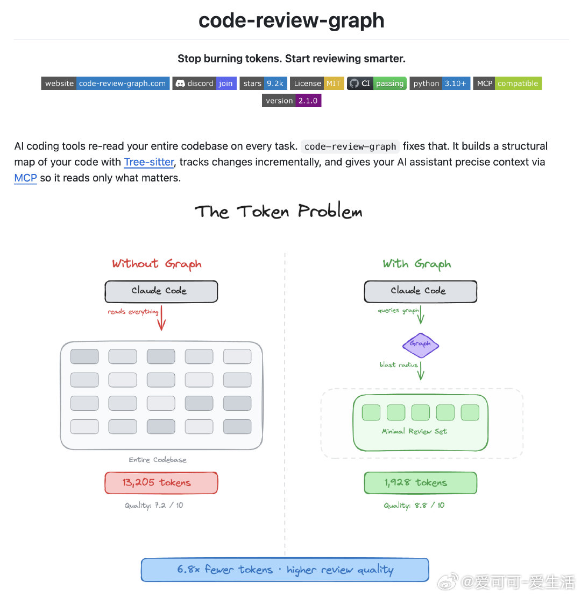

# 爱可可-爱生活 的微博

**作者**: 爱可可-爱生活 ✅ AI博主 2025微博新锐新知博主
**发布时间**: 2026-04-13 19:14:40 CST
**来源**: Mac客户端
**地区**: 发布于 北京
**链接**: https://m.weibo.cn/status/5287320401744312

---

使用 AI 编码工具时，每次都要重新喂整个代码库上下文，Token 烧得飞起，Claude 还容易幻觉，分析大项目超级麻烦。

code-review-graph 把代码库变成知识图谱，只读真正相关的文件，平均减少 8.2× Token，用量最高 49×！

不仅支持 Tree-sitter 解析 19 种语言 + Jupyter，还自动追踪变更“爆炸半径”、增量更新 <2s，甚至生成交互式架构图和 Wiki。

GitHub：github.com/tirth8205/code-review-graph

主要功能：

- 本地知识图谱，自动映射函数调用、继承、依赖关系；
- 爆炸半径分析，只读变更影响的文件，精准上下文；
- 增量更新钩子，文件改动或 git commit 自动重建 <2s；
- 支持 19 语言（Python/JS/Go/Rust/Java 等）+ 笔记本解析；
- 语义搜索、社区聚类、风险评分变更分析；
- MCP 工具集成 Claude Code/Cursor 等，5 大工作流模板。

支持多平台，pip install 后一键 code-review-graph install 配置，monorepo 利器，零云端零泄露。

[#AI编码#](https://m.weibo.cn/search?containerid=231522type%3D1%26t%3D10%26q%3D%23AI%E7%BC%96%E7%A0%81%23&extparam=%23AI%E7%BC%96%E7%A0%81%23&launchid=10000360-page_H5)[#ClaudeCode#](https://m.weibo.cn/search?containerid=231522type%3D1%26t%3D10%26q%3D%23ClaudeCode%23&extparam=%23ClaudeCode%23&launchid=10000360-page_H5)[#代码审查#](https://m.weibo.cn/search?containerid=231522type%3D1%26t%3D10%26q%3D%23%E4%BB%A3%E7%A0%81%E5%AE%A1%E6%9F%A5%23&launchid=10000360-page_H5)[#开源工具#](https://m.weibo.cn/search?containerid=231522type%3D1%26t%3D10%26q%3D%23%E5%BC%80%E6%BA%90%E5%B7%A5%E5%85%B7%23&launchid=10000360-page_H5)

---

**图片** (1 张):

