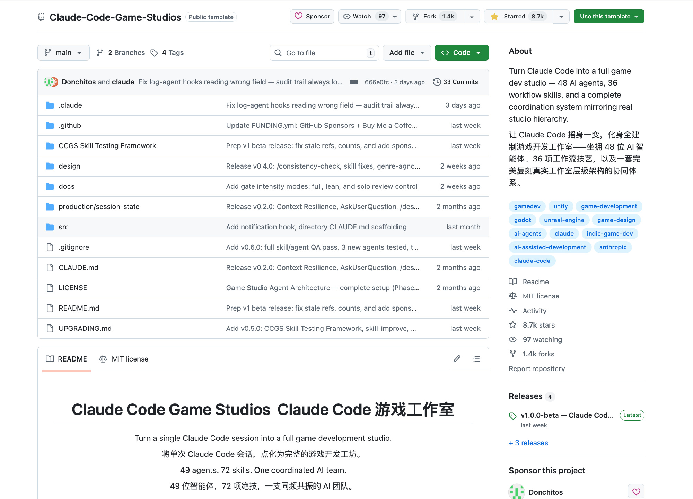
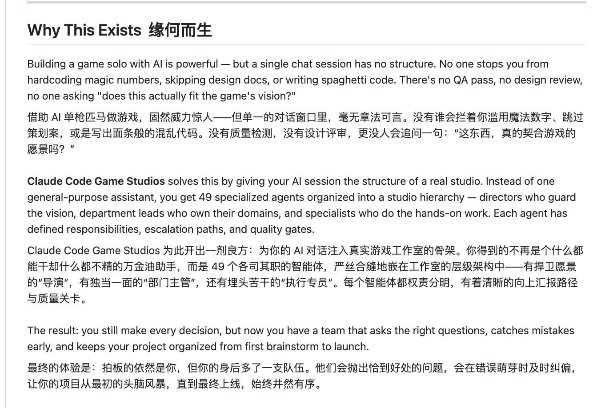
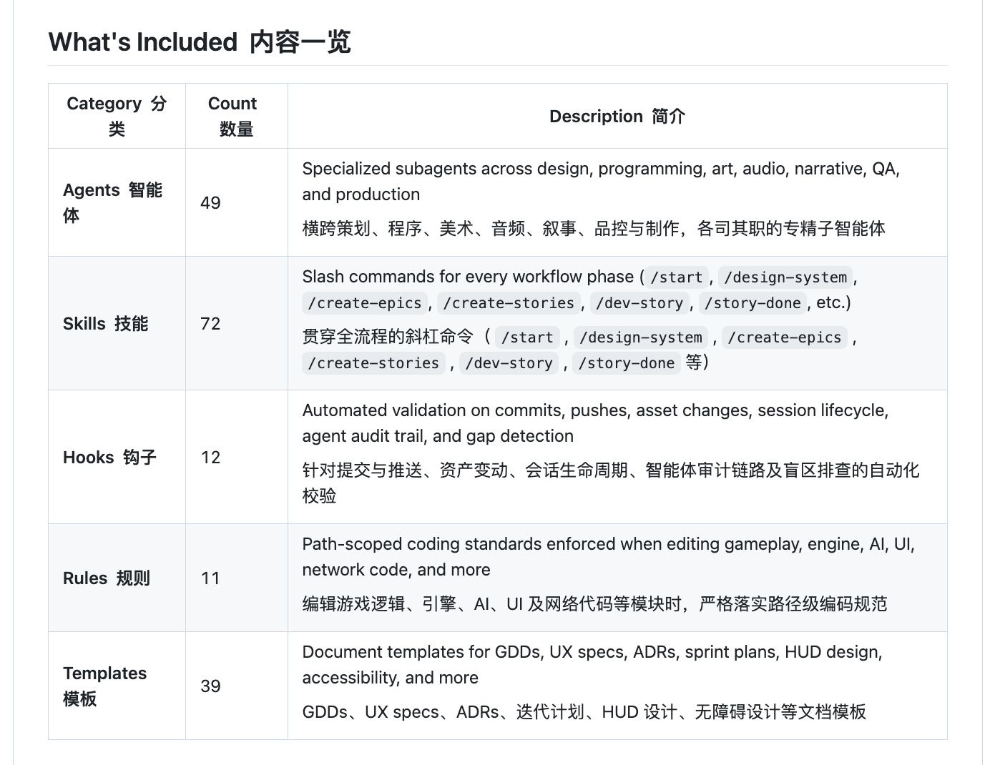
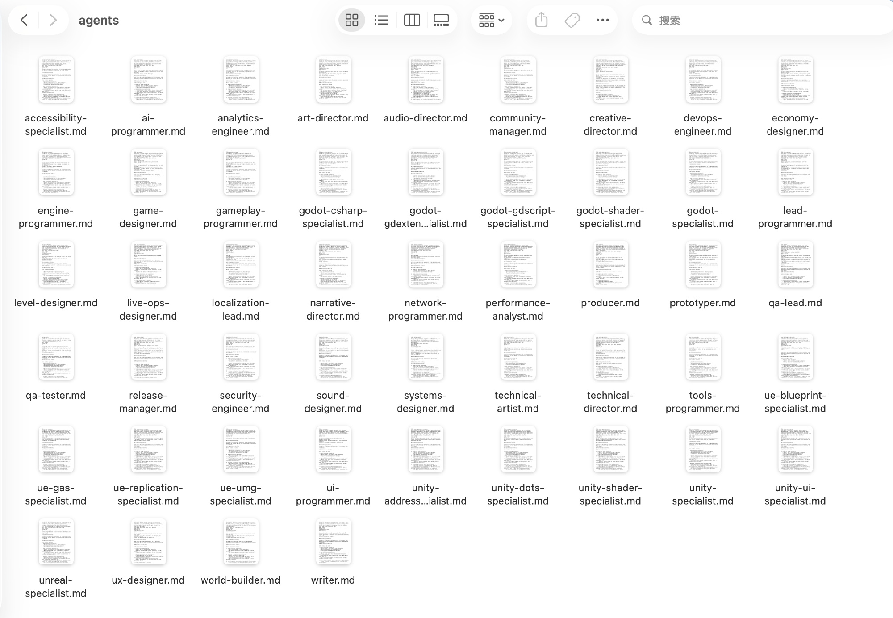
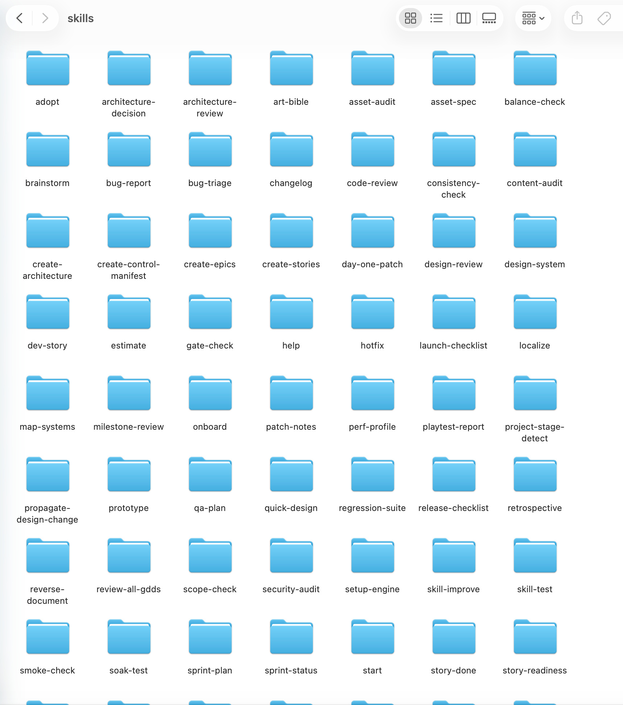
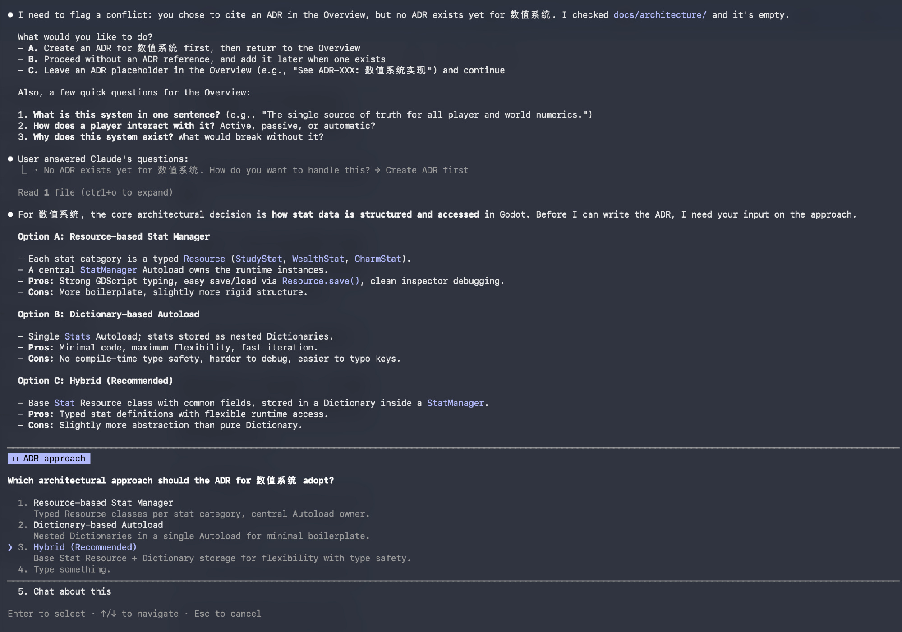

# i陆三金 的微博

**作者**: i陆三金 ✅ AI博主
**发布时间**: 2026-04-13 16:05:00 CST
**来源**: 微博网页版
**地区**: 发布于 北京
**链接**: https://m.weibo.cn/status/5287272670825791

---

在玩这个项目：Claude-Code-Game-Studios，一个可实现游戏开发全流程的 Claude Code 游戏开发框架

本来以为是个高 🌟 网红项目，没想到有点意思

看着它的 49 个 agents 和 72 个 skills，我陷入了沉思

整个操作流程也基本是做选择题，我除了提供一个想法之外，好像没干啥

链接：github.com/Donchitos/Claude-Code-Game-Studios

---

**图片** (6 张):

