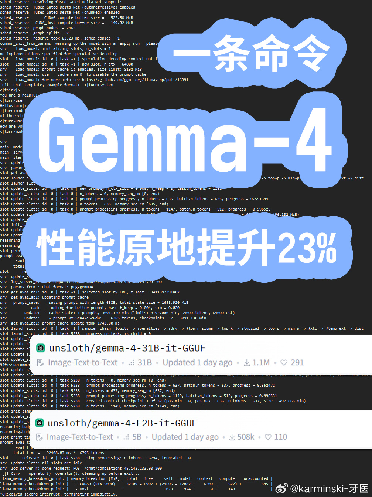
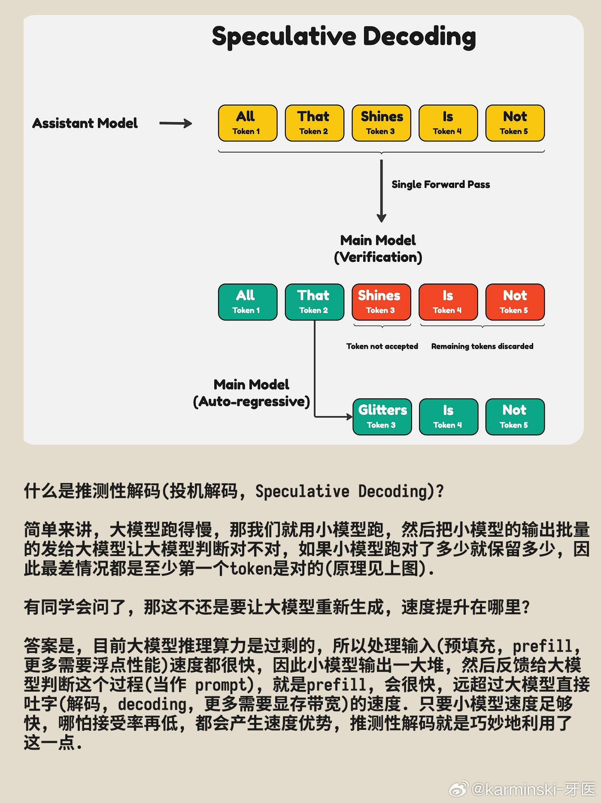
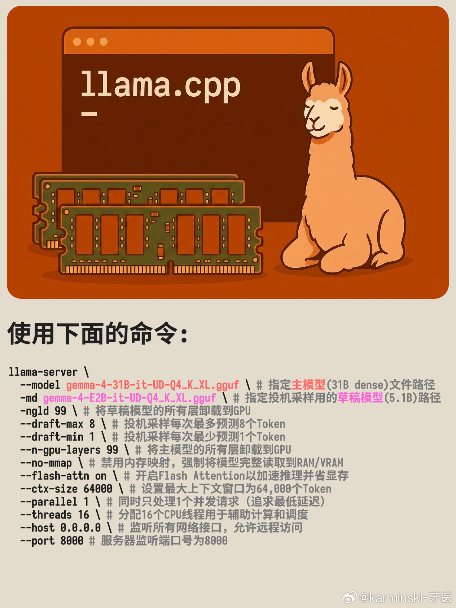
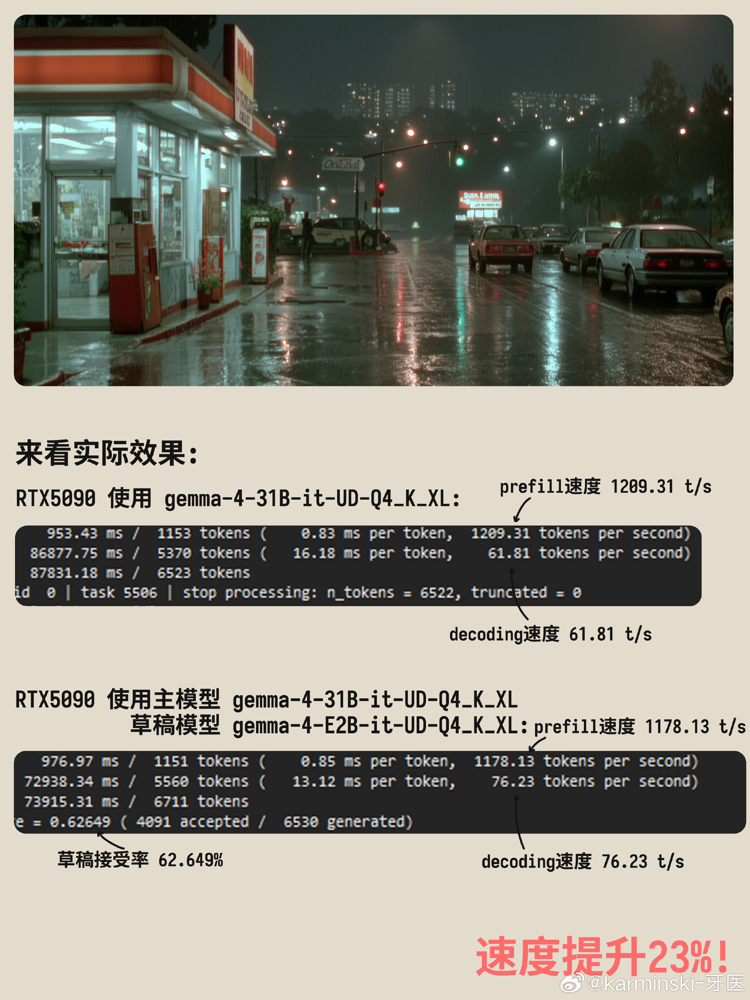

# karminski-牙医 的微博

**作者**: karminski-牙医 ✅ AI博主
**发布时间**: 2026-04-13 08:55:02 CST
**来源**: 微博网页版
**地区**: 发布于 日本
**链接**: https://m.weibo.cn/status/5287164465908242

---

Gemma4提速秘籍! 一条命令速度提升23%!

不卖关子哈, 记得用推测性解码, 这次Gemma4发布的模型尺寸梯次正好适合用推测性解码, 如果你在用31B dense 觉得不够快, 可以再加上E2B(5.1B)作为草稿模型, 我实测RTX5090可以把吐字(解码)速度提升23%! 从61 token/s 提升到了76 token/s. 并且推测性解码本身是不会降智的.

等会, 你要问什么是推测性解码(投机解码, Speculative Decoding)? 

简单来讲, 大模型跑得慢, 那我们就用小模型先跑, 然后把小模型的输出批量的发给大模型让大模型判断对不对, 小模型跑对了多少就保留多少, 因此最差情况都是至少第一个token是对的(原理见上图).

有同学会问了, 那这不还是要让大模型重新生成, 速度提升在哪里? 

答案是, 目前大模型推理【算力】是过剩的, 【显存带宽】是不足的, 所以处理输入(预填充, prefill, 更多需要浮点性能)速度都很快. 因此小模型输出一大堆, 然后反馈给大模型判断这个过程(当作 prompt), 就是prefill, 会很快, 远超过大模型直接吐字(解码, decoding, 更多需要显存带宽)的速度. 只要小模型速度足够快, 哪怕接受率再低, 都会产生速度优势, 推测性解码就是巧妙地利用了这一点. 

最后我把我测试的最佳参数放在了图3, 大家可以参考. 另外记得不要混搭, Gemma4就搭配Gemma4, 不要搭配Qwen3.5. 会出现不兼容问题. 

[#HOW I AI#](https://m.weibo.cn/search?containerid=231522type%3D1%26t%3D10%26q%3D%23HOW+I+AI%23&extparam=%23HOW+I+AI%23&launchid=10000360-page_H5)[#gemma4#](https://m.weibo.cn/search?containerid=231522type%3D1%26t%3D10%26q%3D%23gemma4%23&extparam=%23gemma4%23&launchid=10000360-page_H5)[#llamacpp#](https://m.weibo.cn/search?containerid=231522type%3D1%26t%3D10%26q%3D%23llamacpp%23&extparam=%23llamacpp%23&launchid=10000360-page_H5)[#qwen35#](https://m.weibo.cn/search?containerid=231522type%3D1%26t%3D10%26q%3D%23qwen35%23&extparam=%23qwen35%23&launchid=10000360-page_H5)[#本地大模型#](https://m.weibo.cn/search?containerid=231522type%3D1%26t%3D10%26q%3D%23%E6%9C%AC%E5%9C%B0%E5%A4%A7%E6%A8%A1%E5%9E%8B%23&extparam=%23%E6%9C%AC%E5%9C%B0%E5%A4%A7%E6%A8%A1%E5%9E%8B%23&launchid=10000360-page_H5)[#推测性解码#](https://m.weibo.cn/search?containerid=231522type%3D1%26t%3D10%26q%3D%23%E6%8E%A8%E6%B5%8B%E6%80%A7%E8%A7%A3%E7%A0%81%23&extparam=%23%E6%8E%A8%E6%B5%8B%E6%80%A7%E8%A7%A3%E7%A0%81%23&launchid=10000360-page_H5)

---

**图片** (4 张):

