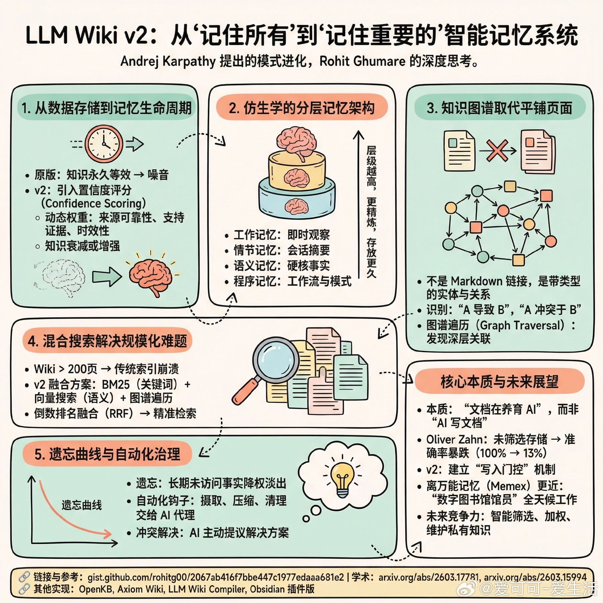

# 爱可可-爱生活 的微博

**作者**: 爱可可-爱生活 ✅ AI博主 2025微博新锐新知博主
**发布时间**: 2026-04-13 19:09:35 CST
**来源**: 微博网页版
**地区**: 发布于 北京
**链接**: https://m.weibo.cn/status/5287319123007513

---

【告别重复劳动：LLM Wiki v2 重新定义 AI 的知识编译方式】

Andrej Karpathy 提出的 LLM Wiki 模式在 48 小时内狂揽 5000 星，其核心在于：让 AI 停止重复劳动，开始“编译”知识。

最近，开发者 Rohit Ghumare 发布的 LLM Wiki v2 将这一模式推向了生产力的新高度。如果说 v1 是“记住所有”，那么 v2 就是“记住重要的”。它不再是一个平面的文档库，而是一个具备生命周期的智能记忆系统。

以下是 v2 带来的核心进化与深度思考：

1. 从数据存储到记忆生命周期
原版模式将所有知识视为永久等效，但在实际应用中，陈旧的知识会变成噪音。v2 引入了置信度评分（Confidence Scoring），根据来源可靠性、支持证据的数量以及信息的时效性动态调整权重。知识不再是静止的，而是会随着时间“衰减”或通过验证“增强”。

2. 仿生学的分层记忆架构
v2 建立了类似人类大脑的存储结构：
- 工作记忆：处理即时观察。
- 情节记忆：压缩后的会话摘要。
- 语义记忆：跨会话的硬核事实。
- 程序记忆：沉淀下来的工作流与模式。
层级越高，知识越精炼，存放时间也越长。

3. 知识图谱取代平铺页面
不再是简单的 Markdown 链接，而是带类型的实体与关系。它能识别“A 导致了 B”或“A 冲突于 B”。通过图谱遍历（Graph Traversal），AI 能发现关键词搜索根本无法触及的深层关联。

4. 混合搜索解决规模化难题
当 Wiki 超过 200 页时，传统的索引文件就会崩溃。v2 采用 BM25（关键词）、向量搜索（语义）与图谱遍历的融合方案，通过倒数排名融合（RRF）确保检索的精准度。

5. 遗忘曲线与自动化治理
- 遗忘曲线：长期未被访问或强化的事实会逐渐降权并淡出。架构决策衰减慢，临时 Bug 衰减快。
- 自动化钩子：自动摄取新源、自动压缩会话、定期清理冗余。将繁琐的“维护工作”彻底交给 AI 代理。
- 冲突解决：当新旧信息矛盾时，AI 不再只是标注，而是根据权威度和时效性主动提议解决方案。

LLM Wiki 的本质并非“AI 写文档”，而是“文档在养育 AI”。

正如 Oliver Zahn 在相关研究中所指出的，在生产环境中，未经筛选的存储会导致准确率从 100% 暴跌至 13%。v2 的意义在于它建立了一套“写入门控”机制。

我们离万能记忆（Memex）的实现又近了一步。这并不是因为我们有了更好的文档或更强的搜索，而是因为我们终于有了能够全天候工作的“数字图书馆馆员”。

未来 AI 系统的竞争力，或许不再取决于模型参数的规模，而取决于它如何智能地筛选、加权并维护其拥有的私有知识。

gist.github.com/rohitg00/2067ab416f7bbe447c1977edaaa681e2

相关学术参考：
- 知识对象与持久记忆：arxiv.org/abs/2603.17781
- 写入门控与选择性记忆：arxiv.org/abs/2603.15994

其他优秀实现参考：
- OpenKB（支持长文档与多模态）：github.com/VectifyAI/OpenKB
- Axiom Wiki（CLI 优先）：github.com/abubakarsiddik31/axiom-wiki
- LLM Wiki Compiler：github.com/atomicmemory/llm-wiki-compiler
- Obsidian 插件版：skills.sh/ignromanov/llm-obsidian-wiki/llm-obsidian-wiki

---

**图片** (1 张):

