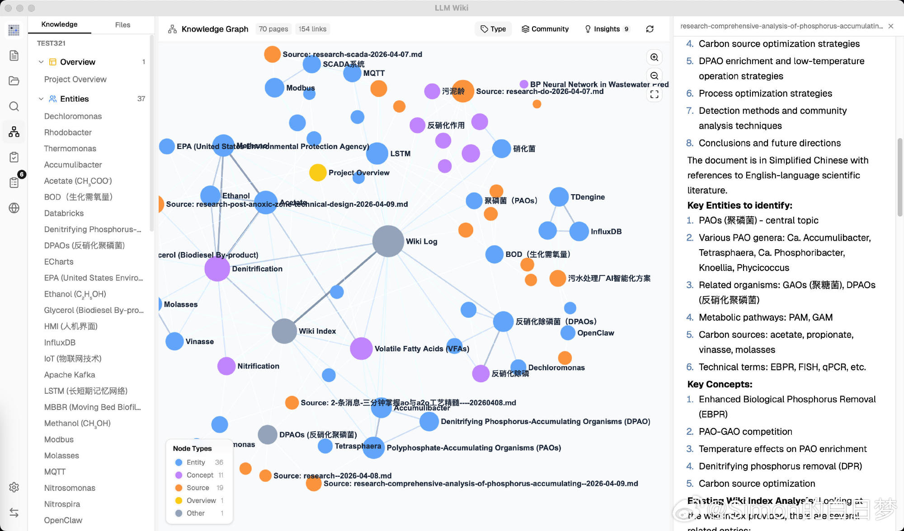
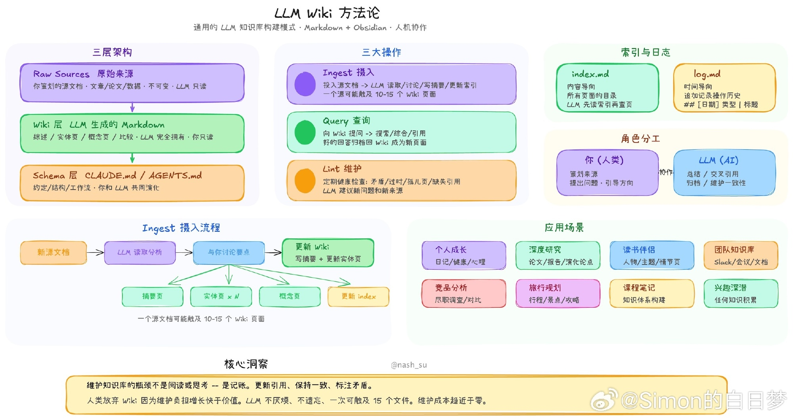
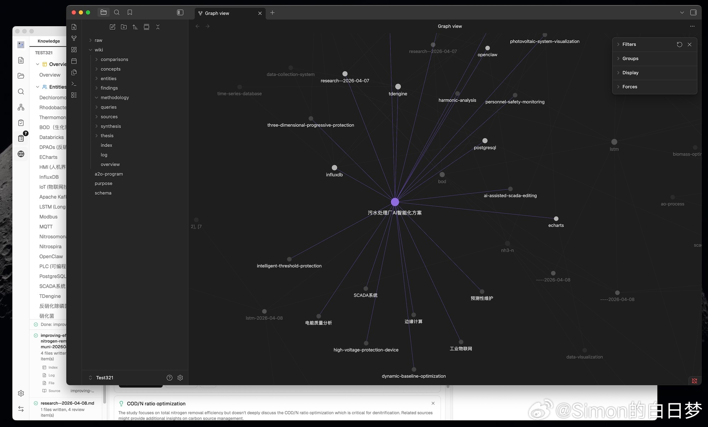
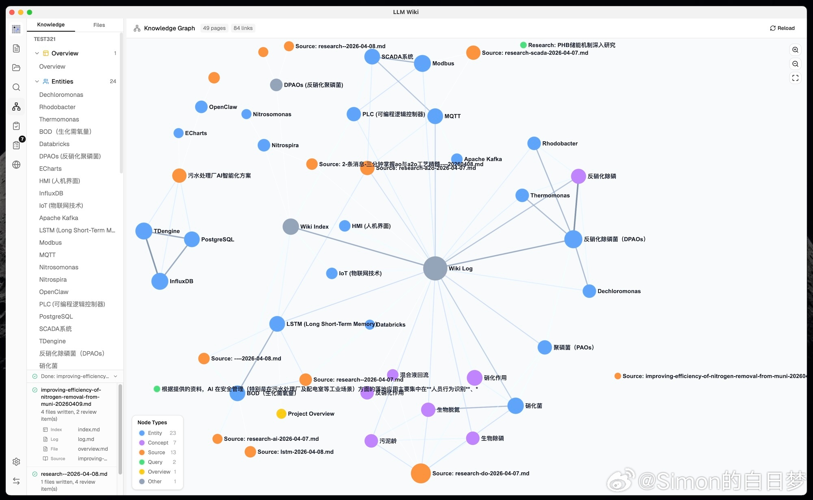
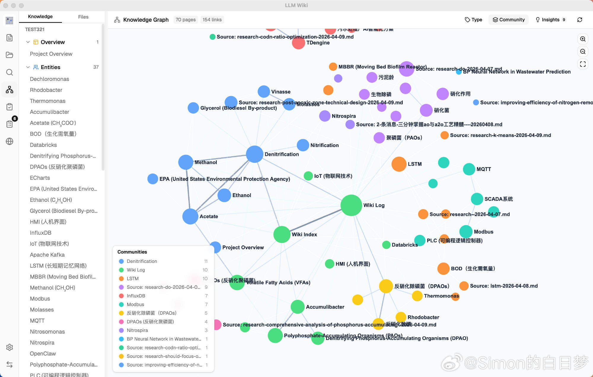
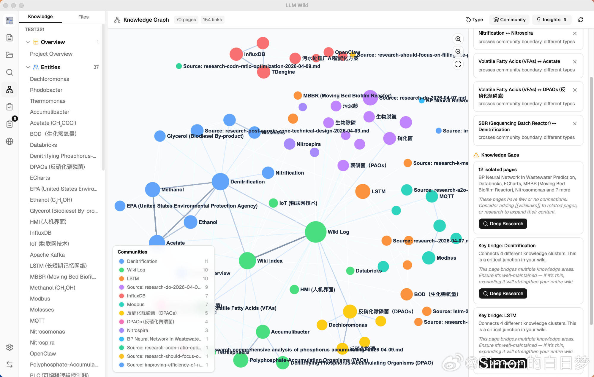

# Simon的白日梦 的微博

**作者**: Simon的白日梦 ✅ 科技博主
**发布时间**: 2026-04-11 12:22:00 CST
**来源**: 微博网页版
**地区**: 发布于 广西
**链接**: https://m.weibo.cn/status/5286491774518092

---

把 Karpathy 那篇著名的 llm-wiki.md 做成了完整的跨平台桌面应用。核心思路是：传统的 RAG 每次都从零检索，这玩意儿让 LLM 增量构建和维护一个持久化的 wiki，知识只写入一次，之后每次查询都基于已经组织好的知识库而不是原始文档堆里打转。

几个真正有意思的设计点：

• 两段式 ingest：先让 LLM 分析原始文档（找实体、关联、矛盾），再基于分析结果生成 wiki 页面——比直接边读边写质量高很多
• 四信号知识图谱：直接链接 ×3.0、来源重叠 ×4.0、Adamic-Adar ×1.5、类型亲和 ×1.0，不是简单关键词匹配
• Louvain 社区发现：自动在知识图谱里找出自然形成的主题簇，还能给每个簇打内聚分
• Deep Research：从知识缺口直接触发 Tavily 网页搜索，结果自动 ingest 回 wiki
• Chrome 剪藏插件：一键把网页 clip 进知识库，自动走两段式 pipeline
• Obsidian 兼容：生成的 wiki 目录直接当 Obsidian vault 用，wikilink 语法完全兼容

技术栈：Tauri v2（Rust 后端）+ React 19 + TypeScript + shadcn/ui + Milkdown 编辑器 + sigma.js 知识图谱 + graphology，支持 PDF/DOCX/PPTX/XLSX 原生解析，KaTeX 数学公式渲染，中英文界面。

对搞知识管理的人来说，这套比大多数 RAG 应用有意思——它在努力让知识长出来，而不是每次临时检索。

💻 GitHub：[网页链接](https://weibo.cn/sinaurl?u=https%3A%2F%2Fgithub.com%2Fnashsu%2Fllm_wiki)
[#HOW I AI#](https://m.weibo.cn/search?containerid=231522type%3D1%26t%3D10%26q%3D%23HOW+I+AI%23&extparam=%23HOW+I+AI%23&launchid=10000360-page_H5) [#ai生活指南#](https://m.weibo.cn/search?containerid=231522type%3D1%26t%3D10%26q%3D%23ai%E7%94%9F%E6%B4%BB%E6%8C%87%E5%8D%97%23&extparam=%23ai%E7%94%9F%E6%B4%BB%E6%8C%87%E5%8D%97%23&launchid=10000360-page_H5) [#知识管理#](https://m.weibo.cn/search?containerid=231522type%3D1%26t%3D10%26q%3D%23%E7%9F%A5%E8%AF%86%E7%AE%A1%E7%90%86%23&isnewpage=1&launchid=10000360-page_H5)

---

**图片** (6 张):

