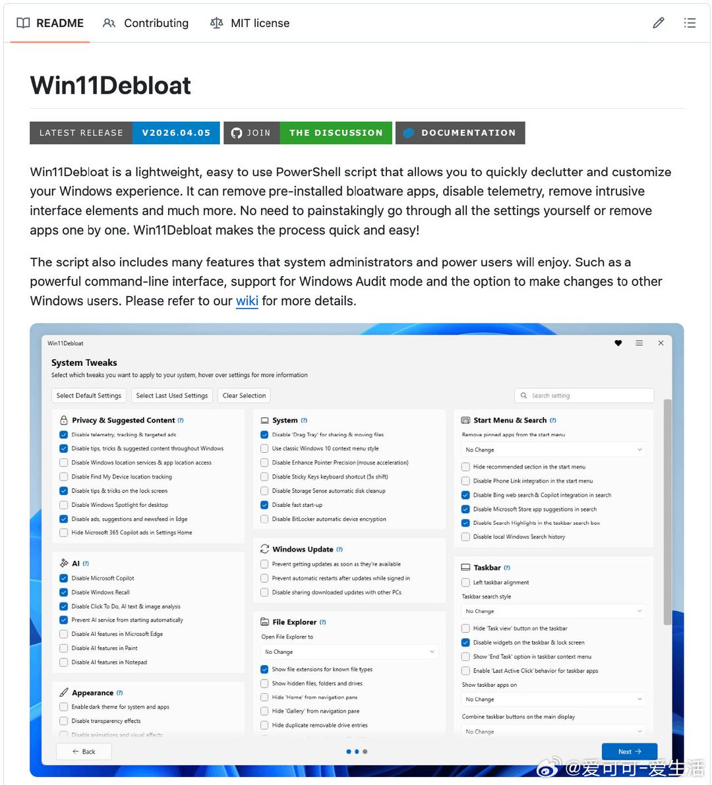

# 爱可可-爱生活 的微博

**作者**: 爱可可-爱生活 ✅ AI博主 2025微博新锐新知博主
**发布时间**: 2026-04-13 18:27:56 CST
**来源**: Mac客户端
**地区**: 发布于 北京
**链接**: https://m.weibo.cn/status/5287308640391410

---

新装Windows电脑总是一堆预装垃圾软件，广告弹窗、遥测追踪、Bing强推、Copilot强制、Recall偷偷截屏，系统臃肿体验差劲。

Win11Debloat 一键PowerShell脚本，快速清理Windows，恢复纯净流畅体验。

不仅移除Candy Crush、TikTok等一堆预装App，还禁用遥测、广告、Copilot、Recall，甚至恢复Win10右键菜单。

GitHub：github.com/Raphire/Win11Debloat

主要功能：

- 移除预装臃肿应用（Candy Crush、Clipchamp、Teams等数十款）；
- 禁用遥测、诊断数据、活动历史、针对性广告追踪；
- 清除开始菜单、设置、锁屏广告及小贴士；
- 禁用Bing搜索劫持、Microsoft Copilot、Windows Recall；
- 恢复Win10风格右键菜单，禁用鼠标加速、动画特效；
- 优化任务栏（左对齐、隐藏小部件）、资源管理器；
- 支持Windows 10/11，变化可通过Microsoft Store回滚。

以管理员权限运行PowerShell，一键执行，轻松搞定，适合新机用户和系统管理员。

[#Windows优化#](https://m.weibo.cn/search?containerid=231522type%3D1%26t%3D10%26q%3D%23Windows%E4%BC%98%E5%8C%96%23&extparam=%23Windows%E4%BC%98%E5%8C%96%23&launchid=10000360-page_H5)[#Win11Debloat#](https://m.weibo.cn/search?containerid=231522type%3D1%26t%3D10%26q%3D%23Win11Debloat%23&extparam=%23Win11Debloat%23&launchid=10000360-page_H5)

---

**图片** (1 张):

