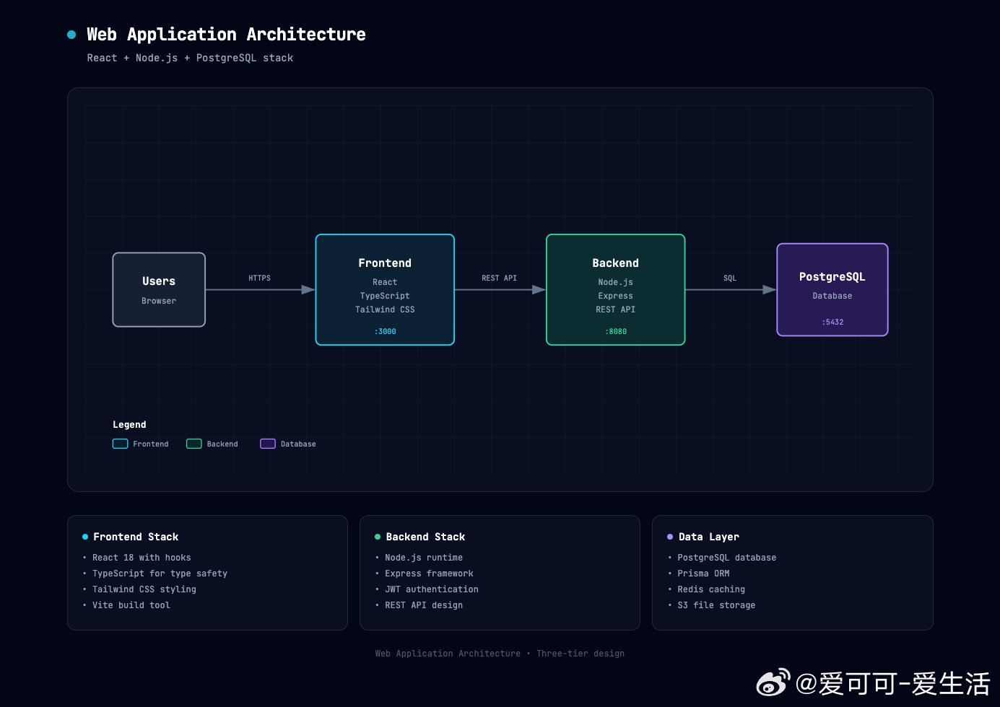
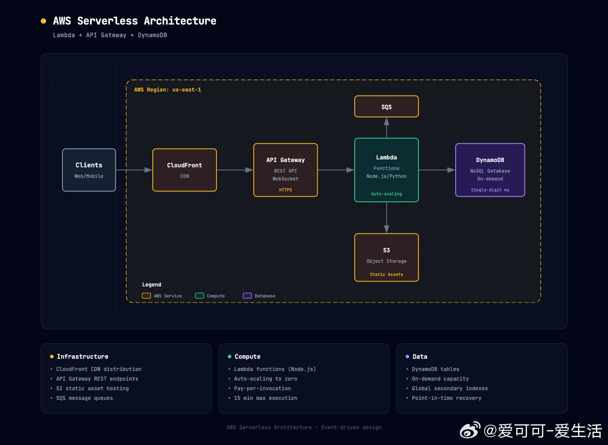
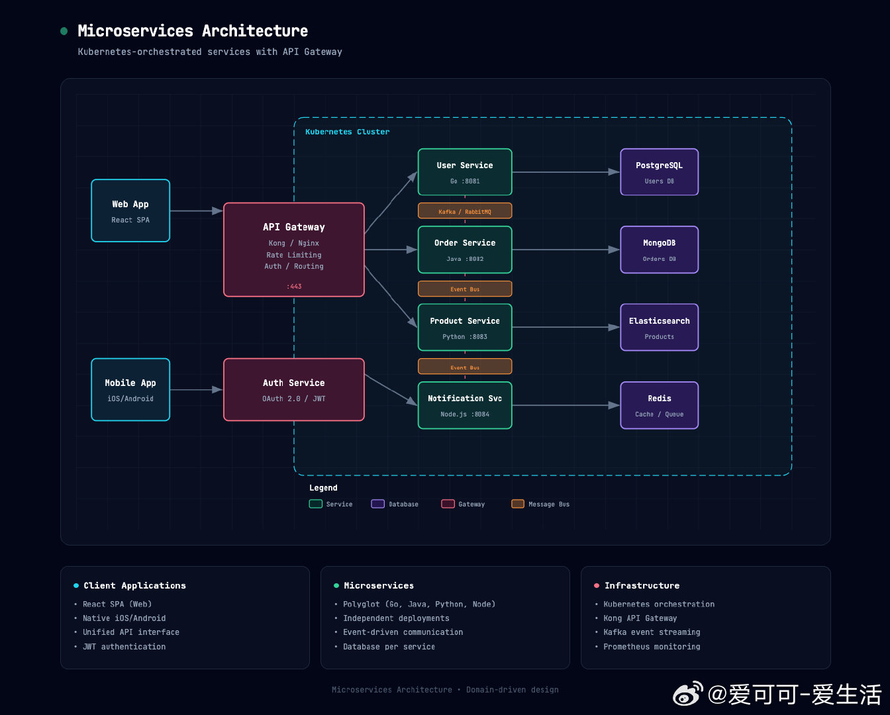

# 爱可可-爱生活 的微博

**作者**: 爱可可-爱生活
**发布时间**: Thu Apr 16 19:45:13 +0800 2026 CST
**来源**: Mac客户端
**地区**: 北京 朝阳区
**链接**: https://m.weibo.cn/status/5288415252973398

---

设计系统架构图经常需要专业绘图工具，切换软件画组件、连接箭头、调整布局，还得导出分享，操作繁琐耗时。

Architecture Diagram Generator 用 AI 一键生成专业架构图，只需纯文本描述系统，就能输出精美暗黑主题的独立 HTML/SVG 文件。

支持 Claude.ai 技能，无需设计技能，浏览器直接打开，支持实时迭代修改，还能轻松分享给团队。

GitHub：github.com/Cocoon-AI/architecture-diagram-generator

主要功能：

- AI 自动生成暗黑主题架构图，语义化颜色编码（前端青色、后端绿、数据库紫色等）；
- 单文件 HTML/SVG 输出，无依赖，浏览器直接打开，支持响应式缩放；
- 纯文本描述即可生成，支持组件、连接、云服务、微服务等复杂架构；
- 实时迭代优化，可让 Claude 修改布局、添加组件或调整样式；
- 专业排版设计，JetBrains Mono 字体，带网格背景和智能层级箭头；
- 示例模板丰富，覆盖 Web 应用、AWS Serverless、Kubernetes 微服务等。

支持 Claude Pro/Max/Team/Enterprise，通过上传 architecture-diagram.zip 安装技能即可使用，适合开发者、架构师和团队协作。

#AI工具 #架构设计 #Claude技能

---

**图片** (3 张):

