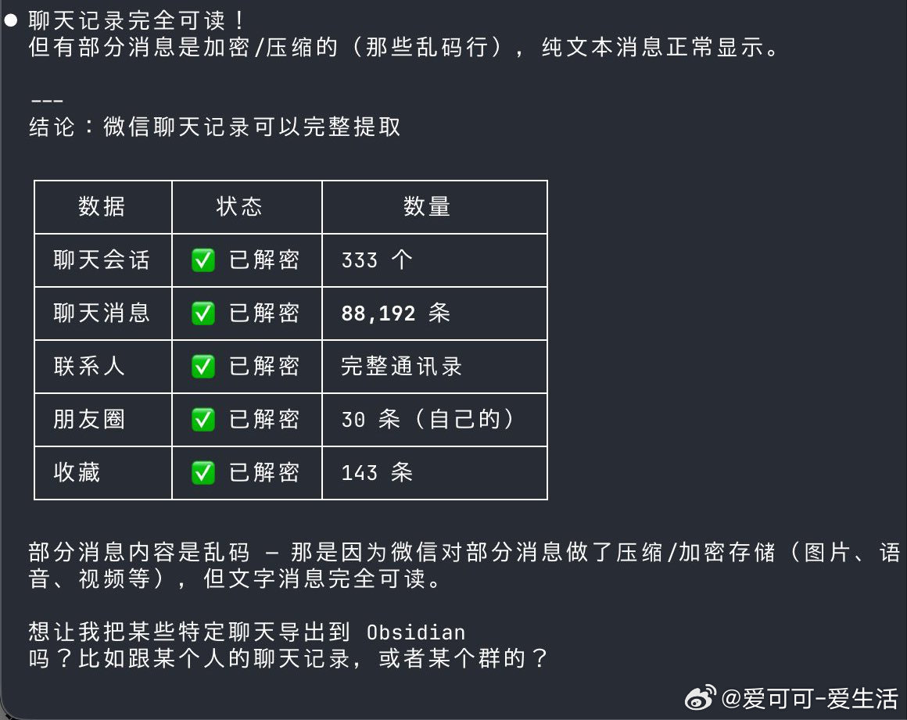

# 爱可可-爱生活 的微博

**作者**: 爱可可-爱生活
**发布时间**: Sat Apr 18 16:14:46 +0800 2026 CST
**来源**: Mac客户端
**地区**: 北京
**链接**: https://m.weibo.cn/status/5289087067753349

---

微信收藏夹内容繁多，却难快速检索和回顾，手动翻找费时费力，分类统计更是一团乱麻。

wx-favorites-report 把微信收藏可视化处理全搞定，从加密数据库到交互式报告一键生成。

不仅有统计仪表盘、月度趋势、类型分布、来源排行，还支持活跃热力图、词云标签云，以及按类型/标签筛选浏览。

GitHub：github.com/zhuyansen/wx-favorites-report

主要功能：

- 智能密钥提取，hook Frida 解密微信 Mac 收藏数据库；
- 丰富统计可视化：总数/日均/最忙日/来源 Top15 排行；
- 多维度图表：月趋势折线、类型甜甜圈、活跃热力图；
- 词云+标签云，自动提取标题关键词和收藏标签；
- 交互浏览区，支持类型/标签筛选、全文搜索、分页排序；
- 单文件 HTML 报告，暗黑主题，ECharts 驱动，点击详情弹窗。

支持 macOS (Apple Silicon/Intel)，用 Claude Code 一键执行全流程，或手动 pip3 + frida 运行，完美回顾你的收藏记忆。

#AI创造营 #ClaudeCodeSkill #微信收藏

---

**图片** (1 张):

