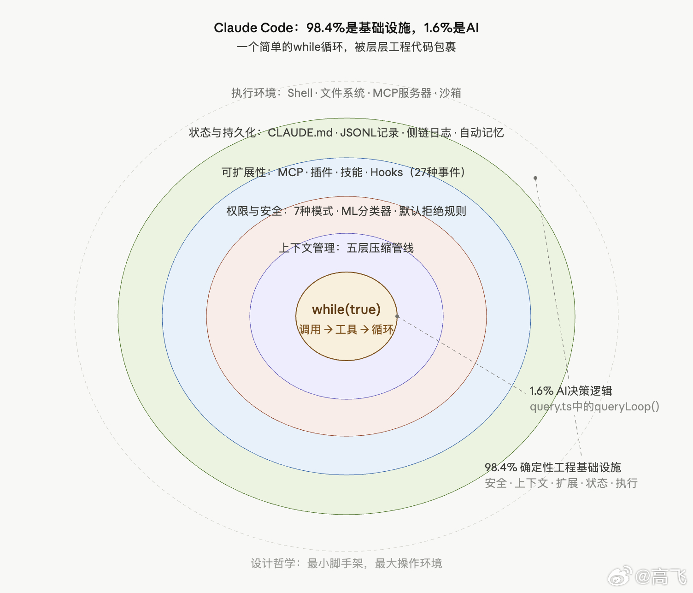
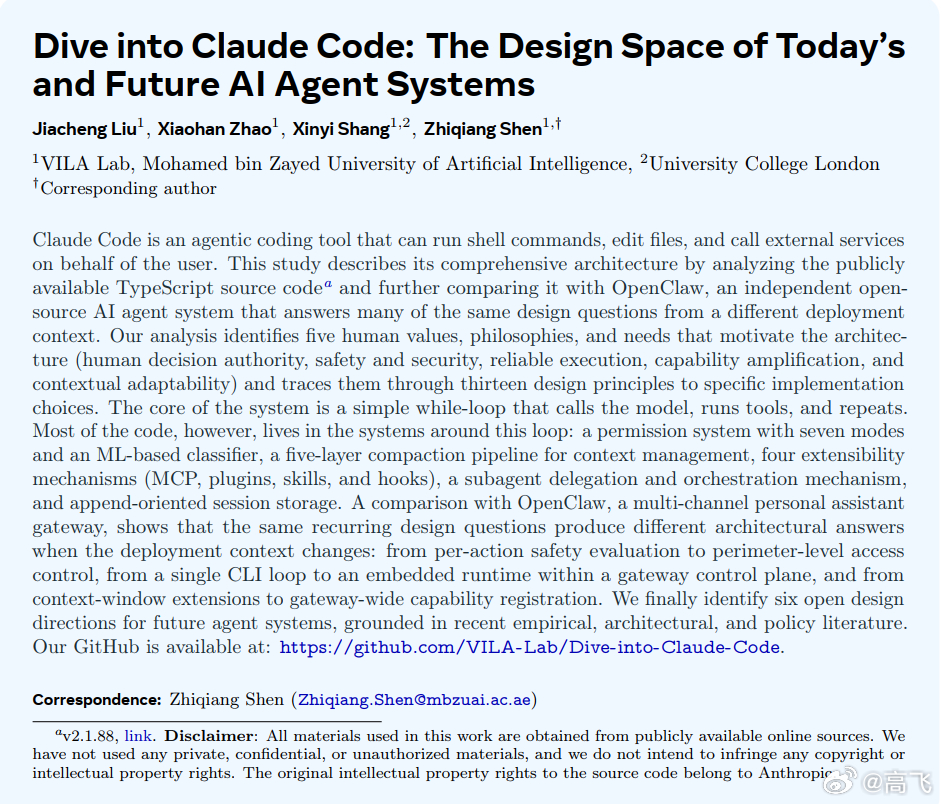

# 高飞 的微博

**作者**: 高飞
**发布时间**: Sun Apr 19 22:49:23 +0800 2026 CST
**来源**: 微博网页版
**地区**: 北京
**链接**: https://m.weibo.cn/status/5289548764677505

---

#模型时代# Claude Code的全部代码，98.4%跟AI无关

刷到一篇正了八景的论文，拆解Claude Code源代码，分享一下。或者说对论文解读，做一个解读。

VILA Lab（阿联酋穆罕默德·本·扎耶德人工智能大学）和伦敦大学学院的四位研究者Jiacheng Liu、Xiaohan Zhao、Xinyi Shang、Zhiqiang Shen在arXiv上挂出一篇技术报告，标题是《Dive into Claude Code: The Design Space of Today's and Future AI Agent Systems》。（2026年4月14日）

这篇论文做了一次系统性的架构分析：把v2.1.88的源码从头到尾拆开，用软件工程的方法，把一个生产级AI编程agent的内部设计逻辑完整还原出来。同时，论文拿开源AI agent系统OpenClaw做了对照，看同样的设计问题在不同部署场景下怎么产出不同答案。

核心结论可以用一句话概括：Claude Code的核心agent循环只是一个简单的while循环，真正复杂的是围绕这个循环的安全、权限、上下文管理、可扩展性和会话持久化系统。社区分析估算，整个代码库里只有约1.6%是AI决策逻辑，剩下98.4%是确定性的工程基础设施。

一是Claude Code的架构哲学是"最小脚手架，最大操作环境"。在AI agent领域，"脚手架"（scaffolding）指的是外部框架替模型做决策的部分，比如用状态图规定"先搜索、再编辑、再测试"这样的固定流程。Claude Code反过来，不替模型规划步骤，而是把投资放在确定性基础设施上（上下文管理、工具路由、错误恢复），让模型自由推理和决策。创始团队自己的说法是"Unix工具而非传统产品"。

二是安全设计不是一道墙，而是七层独立的防线，任何一层都能单独阻止一个危险操作。这么做的原因是Anthropic自己的数据显示，用户对权限弹窗的批准率高达93%，说明靠人盯是靠不住的。

三是论文提出了一个批判视角，说：Claude Code极大地放大了程序员的短期产出能力，但缺乏显式机制来维护人类的长期技能。Anthropic自己132名工程师和研究者的内部调查也记录了一个"监督悖论"：过度依赖AI可能侵蚀用来监督AI的那些技能本身。我觉得吧，这条有点强人所难了。

1、先把Claude Code的定位说清楚。

它是Anthropic发布的agentic coding tool，能执行shell命令、编辑文件、调用外部服务。跟GitHub Copilot那种自动补全工具不同，Claude Code是完全自主的：它自己规划多步操作、执行命令、读写文件、检查结果、反复迭代直到任务完成。Anthropic内部对132名工程师和研究者的调查显示，约27%的Claude Code辅助任务属于"没有这个工具根本不会去尝试"的工作，也就是说，这个架构带来的不只是加速，而是开辟了全新的工作流。

2、论文从源码里提炼出驱动Claude Code架构的五个价值观。

第一个是人类决策权威。人类保留最终决定权，通过一个层级化的委托人体系（Anthropic > 运营商 > 用户）来明确谁有权决定什么。第二个是安全、隐私和保护。系统有义务在人类注意力松懈时仍然保护他们，这跟"决策权"是两件事。第三个是可靠执行。agent做的事必须是人类真正想要的，跨上下文窗口、跨会话恢复、跨多agent委托都要保持一致。第四个是能力放大。每单位人力投入产出更多成果。第五个是情境适应性。系统适应用户的具体项目、工具、习惯，而且这个适应关系随时间进化。Anthropic的纵向数据表明，用户的自动批准率从不到50次会话时的约20%上升到750次会话时的40%以上。

3、这五个价值观通过13条设计原则落地到代码里。

几个关键原则：默认拒绝并交由人类升级处理（遇到不认识的操作，拒绝而非默默执行）；渐进信任谱系（不是固定权限级别，而是用户随时间推移逐步扩展agent的自主权）；纵深防御（不靠单一安全边界，多层独立机制叠加）；最小脚手架、最大操作环境（不投资在限制模型推理的框架上，而是搭建丰富的操作基础设施让模型自由决策）。论文把每条原则都追溯到了具体的源代码文件。

4、Claude Code在源码层面有7个功能组件和5层子系统架构。

7个组件是：用户、界面层、agent循环、权限系统、工具、状态与持久化、执行环境。用户可以通过四种方式进入系统：交互式CLI（在终端里跟agent对话）、无头CLI（headless，用命令行一次性提交任务，不需要交互，适合自动化脚本）、Agent SDK（供开发者把Claude Code嵌入自己的程序）、以及IDE集成（VS Code等编辑器里直接使用）。关键设计：这四种入口最终汇入同一个agent循环，共享同一套安全和执行逻辑，不存在"从某个入口进来就绕过权限检查"的情况。

5层子系统从外到内：表面层（入口和渲染）、核心层（agent循环和压缩管线）、安全/动作层（权限、hooks、工具、沙箱、子agent）、状态层（上下文组装、会话持久化、CLAUDE.md和记忆）、后端层（执行引擎和外部资源）。

5、agent循环本身出奇地简单。

核心是query.ts里的queryLoop()函数，一个异步生成器。每一轮的流程是固定的：解析设置 → 初始化可变状态 → 组装上下文 → 运行五个上下文整形器 → 调用模型 → 如果模型返回tool_use块就分发给工具执行 → 收集结果追加到对话 → 如果没有tool_use块就结束本轮。

这里需要解释几个关键概念。tool_use是Claude API的一种结构化输出格式，模型不是直接去执行操作，而是输出一段声明："我想调用某某工具，参数是某某"。这段声明被外围的harness（可以理解为"执行外壳"，负责安全检查、权限验证、工具分发的确定性代码层）接收后，由harness决定是否批准、怎么执行、结果怎么返回给模型。模型本身从不直接接触文件系统、shell或网络。这意味着即使模型被prompt注入攻击，它也无法绕过harness层的沙箱和权限检查。

这种"模型提议、外壳执行"的分工是一个典型的ReAct模式（Reasoning + Acting，由Yao等人在2022年提出），循环结构是：推理 → 行动 → 观察结果 → 再推理。与之对比，LangGraph等框架用开发者预定义的状态图来控制流程走向，Claude Code不这么做，它让模型自己决定下一步干什么，harness只管安全和执行。

6、围绕这个简单循环，最重要的工程投资之一是五层上下文压缩管线。

上下文窗口是整个系统的硬约束。所谓上下文窗口，就是模型每次被调用时能"看到"的全部信息量上限，Claude 4.6系列约为100万token。一个长时间运行的编码任务，对话历史、文件内容、命令输出、工具返回结果会不断累积，很快就会逼近甚至超过这个上限。一旦超限，模型要么报错停止，要么丢失早期上下文导致行为不一致。所以上下文管理不是锦上添花，而是agent能否完成复杂任务的前提条件。

Claude Code的做法是在每次模型调用前，按顺序跑五个"整形器"（context shaper），每层处理一种类型的压力，成本递增。第一层是预算裁减（Budget Reduction），对单条工具输出限制大小，超出的用内容引用替换，相当于"这个文件太长了，我只告诉你文件在哪，不全贴进来"。第二层是Snip，直接剪掉较旧的历史片段。第三层是Microcompact，细粒度压缩，可选的缓存感知路径等API返回后才确定边界。第四层是Context Collapse，不修改实际历史记录，而是生成一个"投影视图"供模型使用——模型看到的是压缩版，但原始完整历史保留在磁盘上，随时可以重建。第五层是Auto-compact，调用模型自身对整段对话生成语义摘要，只在前四层都不够时才启动，因为这一步本身就要消耗一次模型调用的成本。

7、权限系统的设计可能是整篇论文里对从业者最有参考价值的部分。

Claude Code有七种权限模式，从plan（所有计划需人工批准才能执行）到default（标准交互）到acceptEdits（编辑自动批准，其他命令要批准）到auto（ML分类器评估）到dontAsk（不提示但deny规则仍生效）到bypassPermissions（跳过大部分提示，关键安全检查仍在）到bubble（子agent权限向父终端升级的内部模式）。规则评估遵循"deny优先"原则：一条宽泛的deny规则（"拒绝所有shell命令"）不能被更具体的allow规则（"允许npm test"）覆盖。

8、自动模式分类器是权限系统中的一个独立安全层。

Anthropic发现用户对93%的权限提示都点了批准。这意味着人工确认作为唯一安全机制在行为上是不可靠的。自动模式分类器加载三种提示资源（基础系统提示、外部权限模板、以及Anthropic内部用户的专用模板），对照对话记录和权限模板评估每个工具调用，输出允许、拒绝或要求人工批准。当分类器或deny规则阻止了某个操作，系统不是硬停，而是把拒绝原因反馈给模型，模型在下一轮循环中尝试更安全的替代方案。

9、可扩展性分成四种独立机制，对应不同的上下文开销。

MCP（Model Context Protocol）服务器提供外部工具集成。MCP是Anthropic主导制定的一套开放协议，让AI agent能够连接外部服务——比如数据库查询、Jira工单、Slack消息——就像给agent装上了标准化的"插头"。代价是每接入一个MCP工具，它的schema（功能描述、参数定义）都要常驻上下文窗口，占用token预算，所以上下文开销最高。

插件（Plugin）是打包和分发格式，支持10种组件类型（命令、agent、技能、hooks、MCP服务器、LSP服务器、输出样式等），一个插件包可以同时从多个维度扩展系统。它解决的问题是：如果你开发了一组相关的扩展能力，不用让用户逐个安装，打成一个包一次搞定。

技能（Skill）是领域专用指令，以SKILL.md文件定义。比如你的团队有一套特定的代码审查规范，把它写成一个Skill，agent在需要时调用SkillTool这个"元工具"，把完整指令注入当前上下文。平时只有技能的简短描述常驻上下文，完整内容按需加载，所以上下文开销低。

Hooks是生命周期拦截器，源码中定义了27种事件类型，覆盖工具调用前后、会话开始结束、权限拒绝、子agent启停等关键节点。举例：你可以写一个PreToolUse hook，在agent每次尝试执行shell命令前自动检查命令是否符合公司安全策略，不符合就直接阻止。Hooks默认不占上下文。

论文的关键观察是：单一扩展API无法覆盖从零上下文开销的生命周期钩子到高开销的工具服务器的全部频谱，所以四种机制各有存在理由。

10、上下文窗口的组装有明确的优先级和结构。

系统提示（含输出样式）在最上层，环境信息（git状态等）缓存一次，CLAUDE.md层级文件按从根目录到当前目录的顺序加载（后加载的优先级更高），技能描述和MCP工具名随后，对话历史和工具结果跟进，压缩摘要替换旧历史。

CLAUDE.md是Claude Code的"项目记忆"机制。它就是一个纯文本Markdown文件，放在项目目录里，告诉agent这个项目的规范、偏好和注意事项。比如"本项目用TypeScript，测试框架是Jest，提交信息用英文"。系统支持四级层次：操作系统级（管理员策略）、用户级（个人全局偏好）、项目级（团队共享，提交到Git）、本地级（个人私有，gitignore掉）。这个设计的关键选择是不用嵌入向量（embedding）或数据库。嵌入向量是另一种常见的AI记忆方案，把文本转成数学向量存进向量数据库，检索时按语义相似度匹配。优点是灵活，缺点是用户看不到、编不了、也没法提交到版本控制。Claude Code选择了可审计性：牺牲检索灵活性，换取用户对agent看到的每一条指令都有完全的可见性和控制权。

11、子agent委托用的是隔离架构。

当任务需要分解时，主agent通过AgentTool产生子agent。举一个具体场景：用户要求"修复auth.test.ts的测试失败"，主agent发现这需要先理解另一个模块的API变更，于是派出一个子agent去读取和分析那个模块，自己继续处理其他部分。

子agent获得独立的上下文窗口，跟父agent的上下文完全隔离。子agent完成后，只把摘要文本返回给父agent，不是完整对话历史。子agent的全部对话存在单独的"侧链记录"（sidechain transcript）文件里，需要时可以回溯，但不会膨胀父agent的上下文。

权限方面，子agent不继承父agent的已批准权限。如果子agent需要执行一个敏感操作，它通过bubble模式把权限请求"冒泡"回父终端，由用户在主界面决定是否批准。

12、会话持久化采用追加式JSONL格式。

每次操作追加到JSONL（JSON Lines）文件里。JSONL是一种简单的日志格式，每行是一条独立的JSON记录，新记录只往末尾追加，不修改也不删除已有行。这跟数据库不同：数据库可以更新和删除记录，JSONL只做追加。好处是完整的操作轨迹始终可审计，坏处是文件会持续增长。恢复和分叉操作从记录文件重建状态。

一个重要设计决策：恢复会话时不恢复权限状态。即使你之前批准过某些操作，重新打开会话后agent要重新请求批准。这防止权限在人不在场时被滥用。

13、论文拿OpenClaw做了对比，揭示了部署场景如何塑造架构。

OpenClaw是多渠道个人助手网关，定位跟Claude Code完全不同。六个对比维度上的差异：部署模型方面，Claude Code是单用户CLI工具，OpenClaw是多用户网关服务。安全架构方面，Claude Code做逐操作的deny-first评估，OpenClaw做边界级访问控制（基于OAuth/API密钥的网关入口）。运行时方面，Claude Code是单循环，OpenClaw把agent运行时嵌入网关控制面。扩展架构方面，Claude Code用上下文窗口扩展，OpenClaw用网关级能力注册。记忆方面，Claude Code用文件系统层级，OpenClaw用数据库支持的知识管理。多agent方面，Claude Code用父子隔离委托，OpenClaw用渠道路由和agent分发。论文的结论是：这些差异不是孰优孰劣，而是证明了同一套设计问题在不同场景下必然产出不同架构。

14、论文识别了四个核心架构权衡。

安全与自主性的权衡：当权限模式从default移到auto再到bypassPermissions，安全判断从"每次问人"逐步移交给算法分类器和静态规则。人参与得越少，agent效率越高，但出错时的兜底也越弱。

对抗条件下的权限模型：安全研究者已经记录到一个具体的退化案例。当一条shell命令包含超过50个子命令时（比如用分号串联大量操作），系统会放弃逐个子命令检查deny规则，退回到单一通用批准提示。原因是逐个解析会导致终端UI冻结。这说明纵深防御的多层设计有一个隐含前提——各层的失败模式不能相互关联。当性能压力同时影响多层时，防线可能一起松动。

上下文效率与透明度：压缩管线丢弃信息以腾出空间，但模型和用户都看不到被丢弃了什么，也无法知道某个决策失误是不是因为关键上下文被压缩掉了。简洁性与可扩展性：四种扩展机制提供了灵活性，代价是开发者需要判断每种场景该用哪种机制。

15、论文的一个尖锐洞察是关于人类能力退化的担忧。

Anthropic自己的内部调查记录了一个"监督悖论"：过度依赖AI有可能侵蚀用来监督AI所需的那些技能。独立研究也发现，AI辅助条件下的开发者在代码理解测试中得分低17%。论文用这个视角审视了Claude Code的五个设计价值观，指出当前架构在放大短期产出方面投资充分，但在维护人类对代码库的深层理解、保持代码库长期一致性、以及维持开发者技能管线方面，缺乏显式机制。这不是说系统做错了什么，而是指出了一个尚未被设计覆盖的维度。

16、论文最后列出六个未来方向。

第一，静默失败与可观测性缺口：agent可能完成任务但引入微妙问题，目前缺乏系统性的评估机制来检测这类情况。第二，跨会话持久化记忆：当前记忆系统是文件级的，缺乏结构化的长期记忆，agent无法像人类同事那样积累对项目的纵向理解。第三，harness边界演进，也就是agent的"执行外壳"管辖范围的扩展：agent的行动范围在哪（本地 vs 云端 vs 跨组织）、什么时候行动（实时 vs 后台 vs 定时）、做什么（从编码扩展到部署、监控、安全审计）。第四，任务周期的尺度扩展：从单次会话扩展到持续数周的科研程序级任务。第五，规模化治理与监督：当组织里有成百上千个agent实例并行运行时，现有的单用户审批模型不够用。第六，长期人类能力的保持，也就是上面第15条提到的问题。

#模型时代

---

**图片** (2 张):

