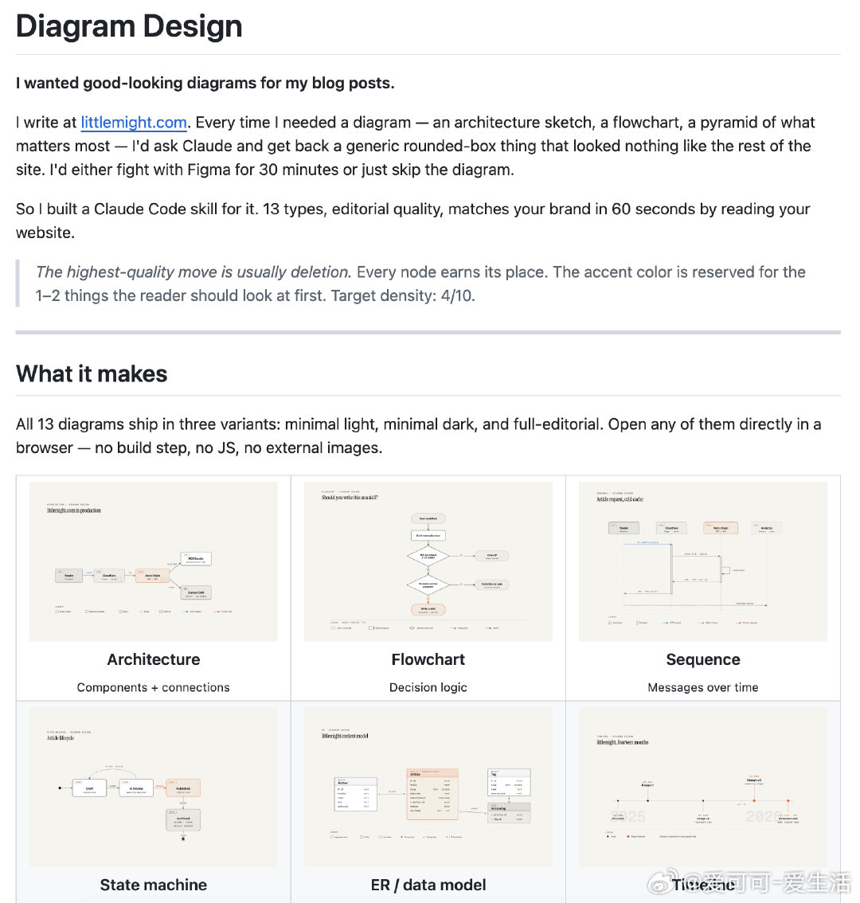

# 爱可可-爱生活 的微博

**作者**: 爱可可-爱生活
**发布时间**: Mon Apr 20 07:58:37 +0800 2026 CST
**来源**: Mac客户端
**地区**: 北京
**链接**: https://m.weibo.cn/status/5289686982987209

---

写博客或文档时总想配上精美图表，架构图、流程图、时间线……每次求Claude生成，不是Mermaid乱码就是圆角盒子泛滥，风格不搭还得重做半天。

diagram-design 专为Claude Code打造的13种编辑级图表技能，自带HTML+SVG，无阴影无依赖，60秒适配你的品牌色。

不仅有架构图、流程图、序列图、状态机、ER模型等完整类型，还支持从网站自动提取配色字体、深浅模式切换，甚至手绘风格变体。

GitHub：github.com/cathrynlavery/diagram-design

主要功能：

- 13种编辑级图表：架构、流程、序列、状态机、ER数据模型、时间线、泳道、象限、嵌套、树状、分层、维恩图、金字塔；
- 自动品牌适配，从你的网站提取纸张/墨水/强调色和字体栈，确保WCAG对比度达标；
- 三种风格变体：极简浅色、极简深色、完整编辑版（带卡片说明）；
- 自包含HTML+SVG，无构建、无JS、无外部图片，浏览器直开即用；
- 智能类型选择+上下文加载，只读必要参考文件，生成高效精准；
- 支持编辑器标注、手绘滤镜等高级原语，完美匹配博客/文档风格。

支持Claude Code技能目录安装，或插件市场一键部署，适配任何品牌博客作者和设计师。

#ClaudeCode #AI工具 #图表设计

---

**图片** (1 张):

