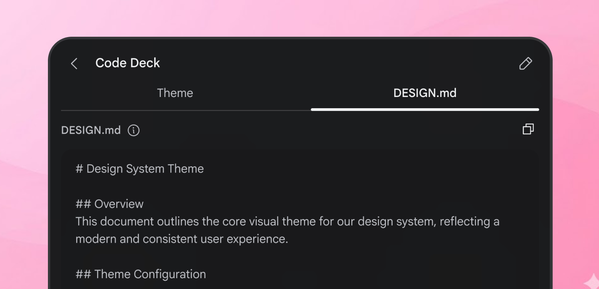
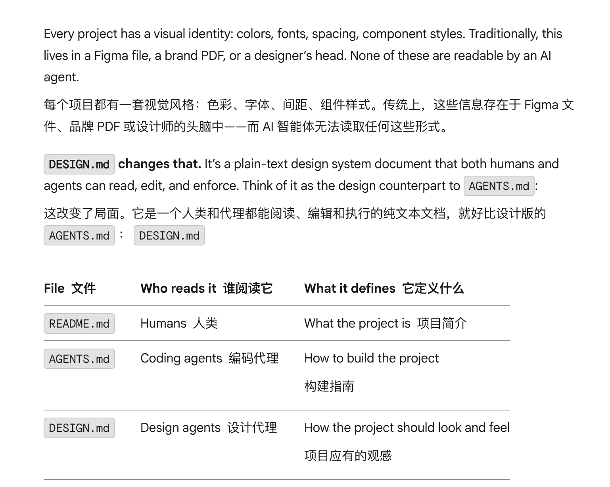

# i陆三金 的微博

**作者**: i陆三金
**发布时间**: Thu Mar 19 12:06:45 +0800 2026 CST
**来源**: 微博网页版
**地区**: 北京
**链接**: https://m.weibo.cn/status/5278153016082872

---

来了解下今天谷歌 vibe design 平台 Stitch 更新的 DESIGN.md，谷歌正在试图通过这份文档来统一 vibe design 中的一致性问题

主要作用：用于在项目中生成风格统一的用户界面

每个项目都有一套视觉风格：色彩、字体、间距、组件样式。传统上，这些信息存在于 Figma 文件、品牌 PDF 或设计师的头脑中——而 AI 智能体无法读取任何这些形式。

DESIGN.md 是一个人类和 agents 都能阅读、编辑和执行的纯文本文档，就好比设计版的 AGENTS.md。

当像 Stitch 这样的设计 agents 读取你的 DESIGN.md 时，它生成的每一个屏幕都遵循同一套视觉法则：你的配色、你的字体、你的组件模式。没有它，每个屏幕都是孤立的；有了它，它们便浑然一体。

DESIGN.md 是一个动态演进的产物，而非一份静态配置文件。它随你的设计一同演进。agents 生成它，你打磨它，并在每次迭代中将其重新应用于屏幕。

三种方式来搓 DESIGN.md
- agent 生成：你通过语言去描述感觉，Stitch 会生成完整的设计系统（颜色、字体、间距、组件样式），并将其总结为 DESIGN.md
- 根据素材生成：提供网址或图片。 agent 会从现有素材中提取你的品牌调色板、字体与风格范式，以此生成 DESIGN.md 。
- 手写：用户可直接编写 DESIGN.md ，精准编码设计偏好。每一部分均为纯 Markdown 格式，无需特殊语法，也无需额外工具。

DESIGN.md 格式
- Overview：对设计外观与感觉的整体描述。在此描述其个性：是活泼还是专业？密集还是宽敞？当没有具体标记适用时，此部分将指导智能体的高层决策。
- Colors ：主色、辅色、第三色及中性色调色板。每种颜色需包含其十六进制值及其用途说明（即代理应如何使用该颜色）。
- Typography ：字体及其在排版层级中的角色：展示、大标题、标题、正文和标签层级。
- Components：组件原子样式指导。聚焦于与你的应用最相关的组件。
- Do's and Don'ts ：实用指南与常见陷阱。它们在设计过程中起到护栏作用。

双重表示：Markdown 只是其中一面。Stitch 同时存储着同一份信息的结构化版本，十六进制数值、字体枚举、间距刻度，以及完整的命名色板。当你编辑 Markdown 时，Stitch 会协调这两种表现形式。

这意味着你可以用模糊的描述（如"暖色系、圆润风格"）来编写 markdown，Stitch 会将其转化为精确的标记；你也可以使用精确标记（如 # 2665fd 、 8px radius ），Stitch 会照单全收。

文档链接：stitch.withgoogle.com/docs/design-md/overview

---

**图片** (2 张):

